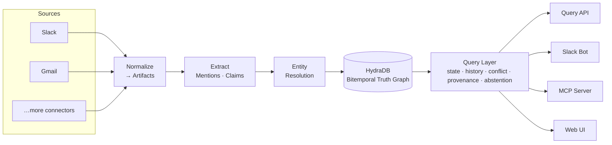

<div align="center">

# Continuum

**Company memory that stays true over time.**

Continuum fuses your company's scattered communication — Slack, Gmail, and more — into a single
temporal knowledge graph, then answers questions about *state* ("who owns the Acme account **now**?")
with the evidence and history behind every answer. When the sources disagree or fall silent, it
abstains instead of guessing.

Built on [HydraDB](https://hydra-db.com), a Neo4j-compatible graph database.

[Quickstart](#quickstart) · [Architecture](#architecture) · [Surfaces](#surfaces) · [Live demo](#live-demo) · [Documentation](docs/README.md)

</div>

---

## Why Continuum

Enterprise knowledge lives in fragments: a decision is announced in Slack, corrected over email a
week later, and referenced in a ticket a month after that. Ask a normal RAG system "who owns Acme?"
and it hands you whichever document ranked highest — often stale, with no sense of *when* it was true.

Continuum treats company knowledge as **bitemporal state**, not documents:

- **Cross-source resolution** — the "Morgan" in Slack and the "morgan@acme.com" in Gmail are the same
  person; claims from every source fuse into one timeline.
- **Temporal truth** — every fact has a validity interval. Continuum knows what was true *then* and
  what is true *now*, and reconstructs the answer from state, not from a single hit.
- **Provenance & abstention** — every answer carries the evidence it was built from, and Continuum
  says "not enough evidence" rather than fabricating one.

The answer to *"who owns Acme now?"* is **reconstructed** — from the resolved entities, the ordered
claims across sources, and their validity windows — never copied from one document.

## Architecture



Sources are normalized to a shared **Artifact / Mention / Claim** contract, extracted into claims,
resolved to canonical entities, and loaded into HydraDB as bitemporal state. A single transport-agnostic
**query layer** serves every surface — so the Web UI, Slack bot, and MCP server all read the *same*
canonical answer.

| Layer | Package | Responsibility |
|-------|---------|----------------|
| Sources | `continuum/sources` | Slack + Gmail adapters, normalization, live sync |
| Extraction | `continuum/extract` | Deterministic + hybrid mention/claim extraction |
| Resolution | `continuum/entities` | Cross-source identity resolution |
| Graph | `continuum/hydradb` | Claim ingestion + bitemporal schema on HydraDB |
| Query | `continuum/query` | State, history, conflict, provenance, abstention |
| Delivery | `continuum/delivery` | Query API, Slack bot, MCP server, formatters |
| Evaluation | `continuum/benchmark`, `continuum/eval` | EnterpriseRAG-Bench harness + scoring |
| Web | `web/` | Next.js product UI + interactive demos |

## Quickstart

**Requirements:** Python ≥ 3.12, Docker (for HydraDB), and Node ≥ 20 (for the web UI).

```bash
# 1. Install the core package (+ the extras you need)
pip install -e ".[delivery,llm,embed,extract]"

# 2. Configure environment
cp .env.example .env        # fill in the values you need

# 3. Start HydraDB (Neo4j-compatible graph)
make hydradb-up             # or: powershell -File scripts/start_hydradb.ps1  (Windows)

# 4. Run the test suite
pytest -q                   # unit tests
pytest -m hydradb -q        # graph integration tests (needs HydraDB up)
```

The optional-dependency groups (`delivery`, `llm`, `embed`, `extract`, `google`) let you install only
what a given surface needs — see [`pyproject.toml`](pyproject.toml).

## Surfaces

Every surface reads the same canonical state through the query layer.

### Query API
A FastAPI service exposing the canonical `/v1` endpoints (ask, graph export, semantic state / history /
conflict / evidence). See [`continuum/delivery/api.py`](continuum/delivery/api.py).

### Slack bot
`@continuum who owns Acme?` returns the current owner, the prior owners, the effective date, and the
sources it was reconstructed from — with a live pipeline checklist. Setup and demo script:
[docs/slack-demo-script.md](docs/slack-demo-script.md).

```bash
python scripts/run_slack_bot.py --mode socket
```

### MCP server
Expose Continuum's memory to any MCP-compatible client (Claude Desktop, IDEs) with one command:

```bash
uv run continuum-mcp
```

Full configuration in [docs/mcp-setup.md](docs/mcp-setup.md).

### Web UI
A Next.js app with the product site and two interactive demos — the cross-source ownership handoff and
the **Redwood** workspace (query a real EnterpriseRAG-Bench slice live, with an Obsidian-style knowledge
graph). See [`web/`](web/).

```bash
cd web && npm install && npm run dev
```

## Live demo

The golden path: a single question, answered correctly as the truth changes across sources.

```bash
python scripts/demo_owner.py default   # Morgan owns Acme        (clean start)
python scripts/demo_owner.py priya     # Priya owns   · Previously: Morgan       (Gmail transfer)
python scripts/demo_owner.py hari      # Hari owns    · Previously: Priya, Morgan (live takeover)
```

Each command updates the canonical memory; asking `who owns Acme now?` on any surface reflects the new
state, reconstructed across Slack + Gmail with full provenance. The deterministic golden-path harness
lives in [`demo/golden-path/`](demo/golden-path/README.md).

## Repository layout

```
continuum/        Core library (sources → extraction → graph → query → delivery)
web/              Next.js product UI + interactive demos
scripts/          Operator tooling (demo drivers, Slack bot, HydraDB lifecycle)
demo/             Deterministic golden-path scenario
data/             Benchmark datasets, fixtures, ground truth
docs/             Documentation (see docs/README.md)
tests/            Unit + HydraDB integration tests
```

## Documentation

The [documentation index](docs/README.md) links everything — architecture and contracts, setup guides
(HydraDB, Slack, Gmail, MCP), the benchmark protocol, and the design research under
[`docs/research/`](docs/research/).

## Development

```bash
pytest -q                       # fast unit tests
pytest -m hydradb -q            # graph integration (HydraDB required)
python -m ruff check .          # lint
```

See [AGENTS.md](AGENTS.md) for the repository's engineering contract and conventions.

## License

No license has been chosen yet — until a `LICENSE` file is added, all rights are reserved by the
authors.
